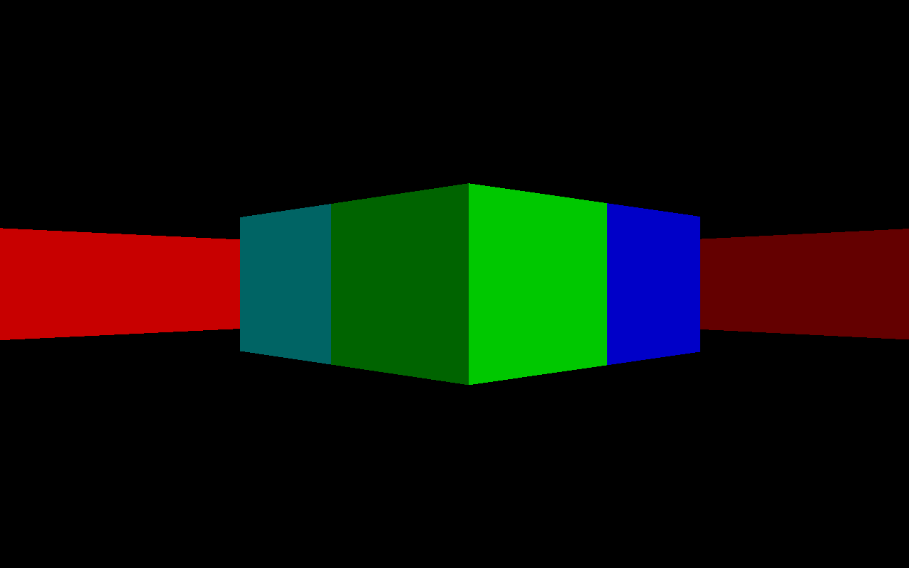
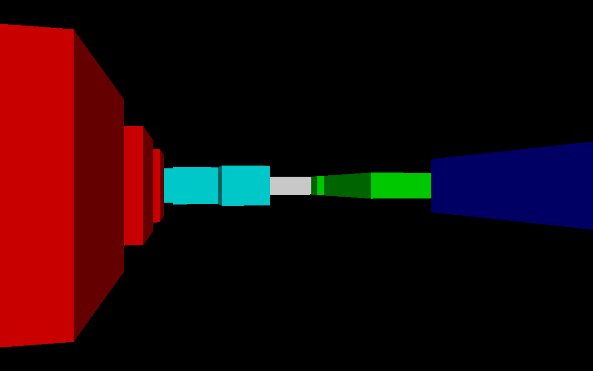

# Kavale: Dédale

Un labyrinthe en python :snake:

## Fonctionalités

- Un monde 2.5D

## Medias

 

## A faire
- [ ] Texture sur les murs
- [ ] Sprites enemies
- [ ] HUD
- [ ] Parametres
- [ ] Menu Principal
- [ ] Class Entity

## Credits
- [RayCasting Algorithm](https://lodev.org/cgtutor/raycasting.html)